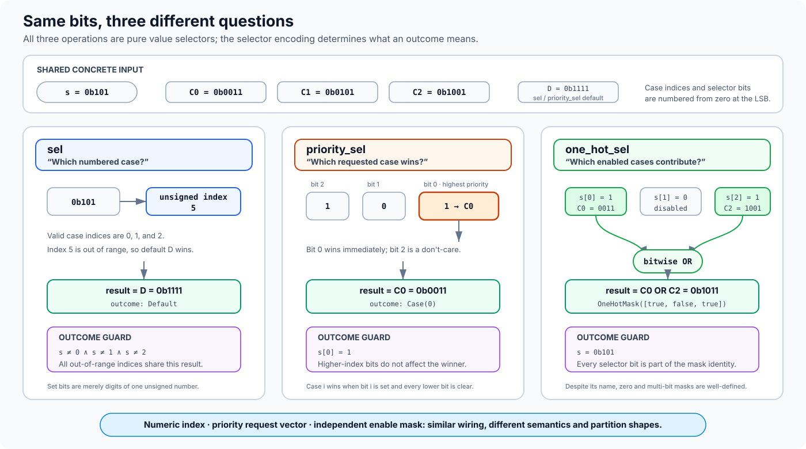

# Design

This document is for contributors and technical reviewers. It is the source of
truth for the evaluator's internal architecture, invariants, and rationale.
Public behavior and selection semantics are specified in the
[`user guide`](../user/guide.md); executable evidence belongs in
[`verification.md`](verification.md).

## Design goals

`xlsynth-symex` is a native Rust symbolic evaluator for finite, pure XLS
functions. Its primary product is complete enumeration of canonical IR
selection traces with concrete witnesses. The architecture is guided by these
invariants:

- public values and constraints are typed and independent of a particular
  solver API;
- concrete inputs prune unused dataflow before expressions are constructed;
- a complete enumeration records every active selection admitted by the
  policy, even when its cases compute the same value;
- every partial result states why it is incomplete;
- observable result ordering and expression rendering are deterministic;
- every feasible guarded result has a typed model that can be replayed through
  XLS; and
- unsupported effects and state are rejected rather than approximated as pure
  values.

## Dataflow, not control flow

Consider a source-level conditional over one-bit `p`:

```text
if p { x + 1 } else { x - 1 }
```

A conventional control-flow graph and XLS IR represent that conditional in
different ways:

[](../assets/dataflow-vs-control-flow.svg)

| Question | Conventional control-flow graph | XLS IR dataflow graph |
|---|---|---|
| What is a vertex? | A basic block containing work to execute | An operation that produces a value |
| What is an edge? | A possible transfer to the next block | A value dependency between operations |
| What does `p` choose? | Which block executes next | Which input value `sel` returns |
| How do alternatives rejoin? | Control reaches a merge block, often with a phi value | Both value cones feed the same `sel` operation |
| What is a graph path? | A sequence of executed blocks and control-flow edges | A directed route through value-dependency edges; not an enumeration unit |

The XLS graph contains `add`, `sub`, and `sel` nodes connected by values; it
has no program counter, branch instruction, or transfer of control between
those nodes. A selection is a value multiplexer. Consequently,
`xlsynth-symex` enumerates canonical selection traces rather than control-flow
or dataflow paths, and does not claim to recreate the original DSLX branches.

“Eager dataflow” describes the XLS value semantics, not an obligation for this
implementation to construct every operand cone up front. Because the supported
functions are pure, once a concrete selector or candidate trace fixes an
outcome, demand-driven evaluation can omit the inactive value cone without
changing the returned value. The mechanics are described in
[`Demand-driven evaluation`](#demand-driven-evaluation).

## Mental model

The core behavior can be seen in a function with nested and parallel one-bit
selections. In the notation below, selector value zero chooses the first case:

```text
inner  = sel(y; A, B)
left   = sel(x; inner, C)
peer   = sel(z; D, D)
result = add(left, peer)
```

For independent symbolic `x`, `y`, and `z`, there are eight concrete selector
assignments but six canonical selection traces. When `x = 1`, `left` selects
`C`, so `inner` cannot affect the function result; `y` is therefore a
don't-care and absent from the trace. The `peer` selection remains active even
though both cases are `D`; otherwise enumeration would silently erase a
selection the IR declares. Merged evaluation preserves the graph as one
conditional value, while enumeration exposes six guarded results.

[](../assets/one-graph-two-views.svg)

*The two entry-point families share value semantics. Enumeration changes how
selection operations are represented, not what the XLS function computes.*

The remainder of the design gives this dataflow model a precise vocabulary,
then explains how values, demanded nodes, candidate states, solver queries,
and typed witnesses realize it.

## Terminology

The following terms form one model and are used consistently by the public API,
implementation, tests, and documentation:

| Term | Precise meaning |
|---|---|
| **Selection site** | One dynamically identified occurrence of `sel`, `priority_sel`, or `one_hot_sel` under the enumeration policy. Its identity contains the function and XLS node id plus invocation and loop-iteration context. |
| **Selection outcome** | The canonical result of resolving an active site: a case index, the default arm, or a selected-case mask for `one_hot_sel`. |
| **Active selection** | A selection site demanded by the function result after earlier outcomes are fixed. A structurally inactive site is absent rather than assigned an arbitrary outcome. |
| **Canonical selection trace** | A sparse map from active selection identities to their outcomes. It identifies an enumerated behavior; it is not a temporal event log or a route through graph edges. |
| **Guard** | The Boolean predicate over symbolic inputs under which one trace applies. It is the conjunction of caller constraints and the exact outcome requirements recorded by that trace. |
| **Residual result** | The symbolic XLS value remaining after the trace's active selections are fixed. Ordinary symbolic data operations may remain in it. |
| **Witness** | A complete typed concrete input assignment satisfying the guard. Under that assignment, the residual result must equal independent concrete XLS evaluation, and concrete enumeration replay must record the same canonical trace. |
| **Guarded result** | One feasible enumeration member: canonical selection trace, guard, residual result, and witness. This is the public `GuardedResult` record. |
| **Selection partition** | The guarded results returned by a complete enumeration. Their traces are unique, their guards are disjoint, and their guards together cover the caller-constrained input domain. |

The term *path* is deliberately not used for the project's enumeration unit.
In XLS documentation and graph theory it already denotes a route through
data-dependency edges; in conventional symbolic execution it usually denotes a
sequence of control-flow decisions. Neither meaning describes a sparse map over
possibly parallel XLS selection sites.

## How the three selection operations differ

`sel`, `priority_sel`, and `one_hot_sel` are all pure value operations, but
their selector bits answer different questions. The distinction is defined by
the [XLS IR semantics](https://google.github.io/xls/ir_semantics/#control-oriented-operations)
and is preserved by both merged evaluation and selection enumeration.

| Operation | Interpretation of the selector | Selector is zero | Several bits are set | Canonical outcome |
|---|---|---|---|---|
| `sel` | The entire bit vector is one unsigned case index. | Case 0 is selected. | The bit pattern still denotes one numeric index; individual set bits have no separate meaning. | `Case(index)` or `Default` |
| `priority_sel` | Bit `i` requests case `i`; lower indices have higher priority. | The required default is selected. | Only the lowest-index set bit wins. | `Case(index)` or `Default` |
| `one_hot_sel` | Bit `i` independently enables case `i`. | The zero value of the result type is returned. | Every enabled case contributes through bitwise OR. | `OneHotMask`, including zero and multi-bit masks |

For `sel`, the selector must be wide enough to represent every case index. An
explicit default is required exactly when some selector values lie outside the
case range; it is forbidden when the cases cover the entire selector domain.
For `priority_sel` and `one_hot_sel`, selector width equals the number of cases.
All cases, and any default, have the same result type.

The name `one_hot_sel` does **not** impose a one-hot precondition. Its result is
well-defined when zero, one, or several selector bits are set. When the result
type is bits, selected cases are bitwise-ORed; for tuples and arrays, the OR
applies recursively to corresponding bits leaves. Consequently, `priority_sel`
and `one_hot_sel` agree when exactly one selector bit is set, but differ in the
all-zero and multi-bit cases.

The following example uses the same selector and case values for all three
operations. It demonstrates why visually similar selector wiring does not
imply the same result or guard:

[](../assets/selector-operations.svg)

With the values shown in the illustration, three selector patterns expose the
distinction:

| Selector | `sel` | `priority_sel` | `one_hot_sel` |
|---|---|---|---|
| `0b000` | `C0 = 0b0011` | `D = 0b1111` | zero, `0b0000` |
| `0b010` | `C2 = 0b1001` | `C1 = 0b0101` | `C1 = 0b0101` |
| `0b101` | out of range, so `D = 0b1111` | bit 0 wins, so `C0 = 0b0011` | `C0 OR C2 = 0b1011` |

Enumeration follows those value semantics while constructing a guard for each
canonical outcome:

- `sel` case `i` has guard `selector = i`; its default guard excludes every
  in-range case index.
- `priority_sel` case `i` requires bit `i` and excludes all lower-index,
  higher-priority bits. Higher-index bits remain don't-cares. Its default guard
  requires every selector bit to be zero.
- `one_hot_sel` records the entire selected-case mask, so its guard fixes every
  selector bit. An unconstrained `N`-bit selector can therefore produce up to
  `2^N` masks before feasibility pruning.

The enumerator therefore treats all three operations as selection sites
without forcing them into one generic choice rule. Each operation defines its
own outcomes, guards, residual value, and potential enumeration cost.

## System boundary

The implementation deliberately composes existing xlsynth layers:

[](../assets/system-boundary.svg)

*The dashed blue boundary is the backend-neutral symbolic core; its orange
region performs typed symbolic evaluation. Z3 is behind a narrow adapter,
concrete XLS replay is an independent validation oracle, and whole-machine
execution consumes results downstream rather than entering this crate.*

`xlsynth` remains the authoritative concrete semantics and independent SMT
reference used by validation. `xlsynth-pir` is the native traversal layer. Its
function-focused representation is treated as a measured dependency: a pinned
operation inventory exposes gaps, and representable extension operations are
desugared before evaluation.

The symbolic layers contain no processor, instruction, clock, or memory
concepts. A downstream tool may encode one explicit state transition as an
ordinary pure function over state arguments and results; sequencing such
transitions remains outside this crate.

## Values and expressions

`SymbolicValue` mirrors the XLS value tree:

- bits leaves refer to typed expressions;
- tuples contain ordered symbolic values; and
- arrays contain a fixed number of ordered symbolic values.

[](../assets/symbolic-values.svg)

*XLS aggregates retain their finite recursive shape. Only bits leaves refer to
expression nodes, and public identities remain structural until an adapter
serializes them for a solver.*

Keeping tuples and arrays structural avoids introducing solver datatypes for
finite XLS aggregates. Dynamic array operations lower to element-wise
expressions with XLS indexing semantics. Zero-width bits remain structural and
are never emitted as an invalid zero-width SMT bit vector.

Bits expressions live in an interned `ExprArena`. Nodes carry their widths and
represent parameters, constants, primitive bit-vector operations, comparisons,
and conditional values. Interning provides deterministic sharing;
construction-time folding and simplification keep concrete work out of the
solver. SMT-LIB is a serialization of this representation, not its source of
truth.

`EvaluationInput` recursively assigns concrete or symbolic status to argument
leaves. Symbolic leaves receive `InputLeaf` identities based on argument and
element positions. Those structural identities also anchor caller assumptions
and solver models, so the public API never depends on rendered variable names.

## Demand-driven evaluation

XLS functions are eager dataflow graphs, but pure evaluation permits a
demand-driven implementation:

1. Demand the target function's return node.
2. Ordinary operations demand their operands.
3. A concretely resolved selection demands only the selected case.
4. A symbolic selection outcome demands only the case or cases enabled by that
   outcome.
5. Shared demanded nodes are memoized within the applicable function,
   invocation, input environment, and candidate state.

This does not change XLS value semantics. It avoids building expressions for
case cones whose values cannot affect the demanded result. The purity boundary
is essential: discarding a token-consuming or stateful operand would not be
semantically valid.

Pure invokes recursively evaluate the callee in a new frame. `counted_for` has
static trip count and stride attributes, so it is evaluated as finite repeated
application of its pure body. Selection identities include callsite and
zero-based iteration frames to distinguish repeated dynamic instances of the
same callee node.

## Candidate states and traces

Selection enumeration threads an evaluation state containing:

- the accumulated guard;
- the sparse canonical selection trace; and
- candidate-local memoized values.

Ordinary operations combine values without splitting the state. A symbolic
active selection produces one candidate per operation-specific outcome. A
concrete active selection records its single outcome without splitting. Each
candidate conjoins the exact outcome guard, records the outcome, and demands
only the selected case or cases. Structurally inactive nested selections are
therefore absent by construction. The per-operation outcome and guard rules are
defined in [`How the three selection operations differ`](#how-the-three-selection-operations-differ).

Candidate construction is syntactic. Feasibility solving subsequently removes
candidates whose outcome guards contradict one another or the caller
assumptions. Trace uniqueness is checked after solving, and guarded results are
sorted by their complete trace identity before being returned.

Structural inactivity is intentionally narrower than semantic irrelevance. If
an active selection's cases compute equal values, it remains an active selection
site. Removing it would change the declared coverage model and would require a
separate, explicit minimization policy.

## Constraints, solving, and witnesses

Caller constraints use a small backend-neutral Boolean and bit-vector language.
Lowering validates that referenced leaves are symbolic and that operand widths
match before adding the expressions to the common DAG.

[](../assets/candidate-lifecycle.svg)

*Candidate construction, feasibility, and request validity are separate
stages. In particular, solver indeterminacy produces explicit incompleteness;
it is neither an invalid request nor evidence that a candidate is infeasible.*

The solver boundary accepts typed symbolic parameters and one Boolean guard.
The current Z3 adapter:

1. lowers the backend-neutral expression arena once through the pinned
   `xlsynth-prover::solver::Solver` interface;
2. maintains one EasySMT-backed Z3 process with a per-query timeout;
3. checks each candidate in a balanced incremental push/pop scope;
4. distinguishes `sat`, `unsat`, and indeterminate results;
5. reads model values for every symbolic leaf through the upstream solver API;
   and
6. rebuilds complete recursive `IrValue` arguments by combining model leaves
   with caller-supplied concrete values.

Solver indeterminacy changes enumeration completeness rather than becoming a
semantic error or a false infeasibility result. Malformed IR, invalid input
shapes, ill-typed constraints, and invalid model reconstruction remain errors.

The persistent session removes process startup from individual candidate
queries without changing public values, constraints, or completeness semantics.
The expression DAG and public constraint language remain solver-independent;
only the private lowering and session layer depends on the selected backend.

## Merged and enumerated evaluation

Merged evaluation and selection enumeration share value and expression
semantics. Merged evaluation retains symbolic selections as conditional
expressions and produces one whole-function result. Under the default policy,
enumeration splits `sel`, `priority_sel`, and `one_hot_sel` sites. Dynamic array
indices, slice positions, shift amounts, and similar symbolic data remain
merged inside each residual result.

Keeping merged evaluation serves three architectural purposes:

- it avoids duplicating the primitive-operation evaluator;
- it provides a comparison target for the piecewise union of guarded results;
  and
- it supports whole-function comparison with XLS's independent SMT
  translation.

Merged equality cannot establish trace completeness: two distinct active
selections may compute the same value. Trace-set, domain-coverage, and mutation
checks remain independent verification obligations.

## Resource and performance model

Expression and candidate construction are bounded separately from solver
queries. Statistics report expression nodes, evaluated nodes, memoization hits,
selection outcomes, solver queries, infeasible candidates, and construction and
solver time.

A hard candidate-expansion ceiling prevents impractical materialization and
reports an incomplete result. The public returned-result limit is applied after
candidate solving; it is an output and completeness limit rather than an
execution budget. Changing that behavior requires an explicit ordering and
early-termination contract.

The main optional extensions are parallel solving, stronger expression
simplification, known-bit propagation, additional upstream solver backends, and
opt-in selection policies for symbolic data selectors. None changes the pure
function boundary. Procs, hardware timing, general memory, and whole-machine
execution remain separate concerns rather than future obligations of this
library.

## Academic lineage and terminology

There is no single established research area named “symbolic execution of
dataflow graphs.” The closest work spans hardware symbolic simulation,
symbolic analysis of block-diagram languages, constraint-based testing of
synchronous dataflow programs, and symbolic execution of RTL. These uses of
“dataflow” should not be confused with compiler data-flow analysis over a
control-flow graph or symbolic scheduling of token-based actor networks.

| Research lineage | Relevant idea | Relationship to this design |
|---|---|---|
| Bryant, [*Symbolic Simulation—Techniques and Applications*](https://www.cs.cmu.edu/~bryant/pubdir/dac90.pdf) (1990) | Propagate symbolic inputs through circuit operations and retain conditional behavior in merged expressions. | Direct precedent for merged evaluation of an XLS function; it does not enumerate selection outcomes. |
| Kanade et al., [*Generating and Analyzing Symbolic Traces of Simulink/Stateflow Models*](https://theory.stanford.edu/~srirams/papers/cav2009.pdf) (2009) | Compose block-level symbolic transformers consisting of a guard and an expression; conditional blocks contribute the choice observed in a concrete simulation. | A transformer resembles one guarded result, but the analysis generalizes one concrete temporal trace rather than enumerating every feasible selection outcome. |
| Li et al., [*SEDGE: Symbolic Example Data Generation for Dataflow Programs*](https://c.csallner.org/papers/li13sedge.pdf) (2013) | Partition operators such as filters into equivalence classes, derive symbolic constraints, and solve for representative input data. | Directly applies symbolic execution to a dataflow DAG, but tuples flow through and may terminate at operators; XLS operands are eager values. |
| Marre and Blanc, [*Test Selection Strategies for Lustre Descriptions in GATeL*](https://doi.org/10.1016/j.entcs.2004.12.010) (2005) | Translate synchronous dataflow equations into guarded constraints and split the input domain by operator sub-cases. | Operator sub-cases and domain splitting resemble selection outcomes and guards, but Lustre adds temporal cycles and state. |
| Ryan and Sturton, [*Sylvia: Countering the Path Explosion Problem in the Symbolic Execution of Hardware Designs*](https://par.nsf.gov/servlets/purl/10529227) (2023) | Split at RTL control statements, explore independent blocks separately, and compose their fragments with SMT. | Addresses parallel hardware choices, but its paths follow RTL control flow rather than mux operations in a pure dataflow graph. |

Together these works provide precedents for the two evaluation modes and their
trade-off: merged symbolic expressions may grow, while guarded outcome
enumeration may produce exponentially many results. They do not supply a
standard term for complete feasible outcome assignments at mux-like value
operations with structurally inactive nested operations omitted.

Bryant, Beatty, and Seger's
[*Formal Hardware Verification by Symbolic Ternary Trajectory Evaluation*](https://www.cs.cmu.edu/~bryant/pubdir/dac91a.pdf)
(1991) is adjacent hardware prior art, but its *trajectory* is a bounded
temporal sequence of circuit states, not a selection-outcome assignment within
one pure function evaluation.

Consequently, `selection site`, `selection outcome`, `guard`, `guarded result`,
and `canonical selection trace` are defined project terms. They describe the
semantics precisely without claiming that a trace is a control-flow or
data-dependency path, or that the combination is academically novel. The
project's correctness argument comes from the independent evidence in
[`verification.md`](verification.md), not from analogy to this prior art.
