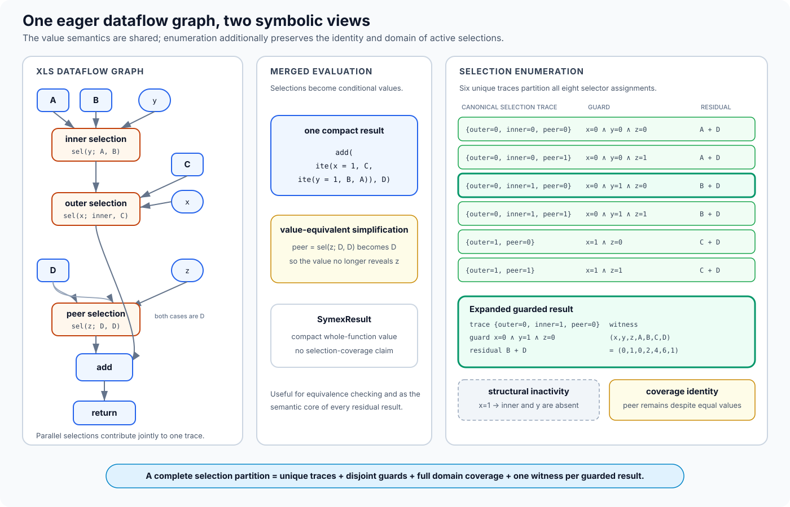
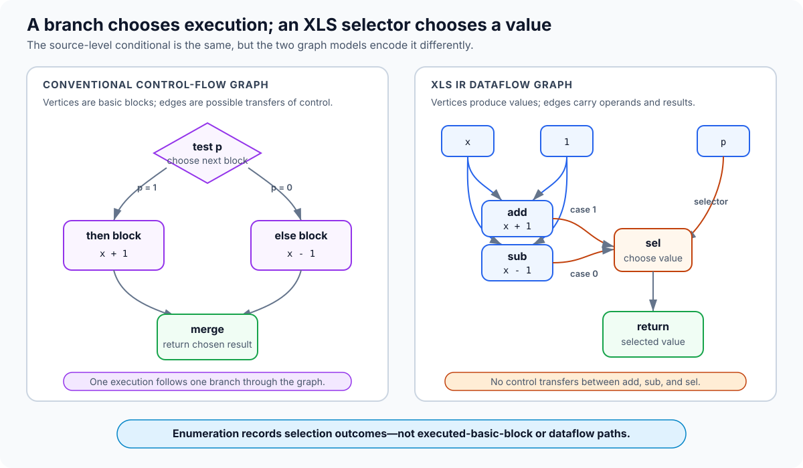
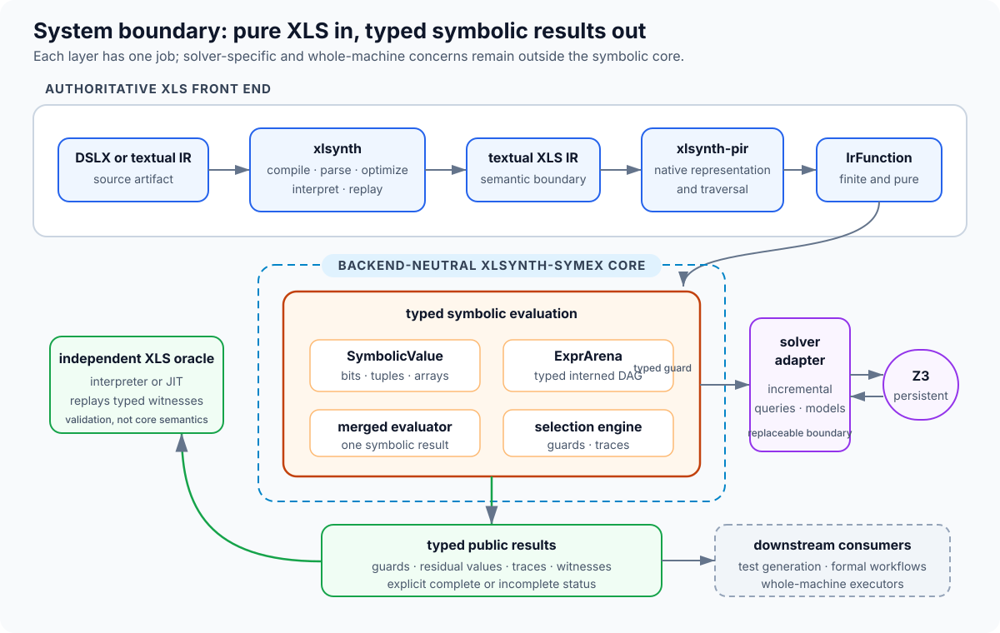
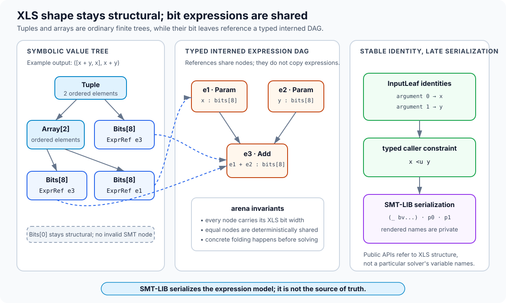
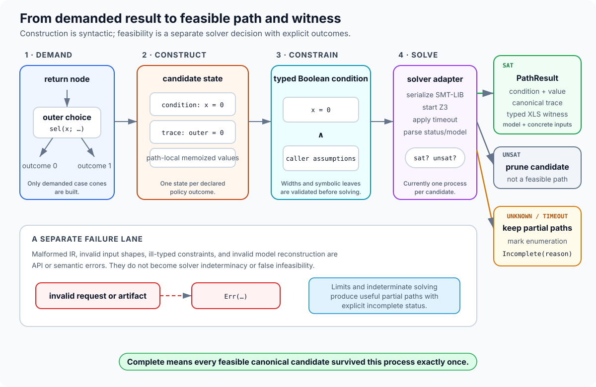

# Design

This document is for contributors and technical reviewers. It is the source of
truth for the evaluator's internal architecture, invariants, and rationale.
Public behavior and selection semantics are specified in the
[`user guide`](../user/guide.md); executable evidence belongs in
[`verification.md`](verification.md).

## Design goals

`xlsynth-symex` is a native Rust symbolic evaluator for finite, pure XLS
functions. Its primary product is complete enumeration of canonical IR
selection traces with concrete witnesses. The architecture is guided by these
invariants:

- public values and constraints are typed and independent of a particular
  solver API;
- concrete inputs prune unused dataflow before expressions are constructed;
- a complete result never hides an in-policy symbolic selection by merging it;
- every partial result states why it is incomplete;
- observable result ordering and expression rendering are deterministic;
- every feasible guarded result has a typed model that can be replayed through XLS; and
- unsupported effects and state are rejected rather than approximated as pure
  values.

## Mental model

The core behavior can be seen in a function with nested and parallel one-bit
selections. In the notation below, selector value zero chooses the first case:

```text
inner  = sel(y; A, B)
left   = sel(x; inner, C)
peer   = sel(z; D, D)
result = add(left, peer)
```

For independent symbolic `x`, `y`, and `z`, there are eight concrete selector
assignments but six canonical selection traces. When `x = 1`, `inner` is outside
the demanded slice, so `y` is a don't-care and absent from the trace. The
`peer` selection remains active even though both cases are `D`; otherwise the
enumeration would silently erase declared coverage. Merged evaluation preserves
the graph as one conditional value, while enumeration exposes six guarded
results.



*The two entry-point families share value semantics. Enumeration changes how
declared selections are represented, not what the XLS function computes.*

This example is intentionally a dataflow graph rather than a control-flow
graph. The remainder of the design explains how values, demanded nodes,
candidate states, solver queries, and typed witnesses realize this model.

## Terminology

The following terms form one model and are used consistently by the public API,
implementation, tests, and documentation:

| Term | Precise meaning |
|---|---|
| **Selection site** | One dynamically identified occurrence of `sel`, `priority_sel`, or `one_hot_sel` under the enumeration policy. Its identity contains the function and XLS node id plus invocation and loop-iteration context. |
| **Selection outcome** | The canonical result of resolving an active site: a case index, the default arm, or a selected-case mask for `one_hot_sel`. |
| **Active selection** | A selection site demanded by the function result after earlier outcomes are fixed. A structurally inactive site is absent rather than assigned an arbitrary outcome. |
| **Canonical selection trace** | A sparse map from active selection identities to their outcomes. It identifies an enumerated behavior; it is not a temporal event log or a route through graph edges. |
| **Guard** | The Boolean predicate over symbolic inputs under which one trace applies. It is the conjunction of caller constraints and the exact outcome requirements recorded by that trace. |
| **Residual result** | The symbolic XLS value remaining after the trace's active selections are fixed. Ordinary symbolic data operations may remain in it. |
| **Witness** | A complete typed concrete input assignment satisfying the guard. Re-evaluation in XLS must produce the residual result and the same canonical trace. |
| **Guarded result** | One feasible enumeration member: canonical selection trace, guard, residual result, and witness. This is the public `GuardedResult` record. |
| **Selection partition** | The guarded results returned by a complete enumeration. Their traces are unique, their guards are disjoint, and their guards together cover the caller-constrained input domain. |

The term *path* is deliberately not used for the project's enumeration unit.
In XLS documentation and graph theory it already denotes a route through
data-dependency edges; in conventional symbolic execution it usually denotes a
sequence of control-flow decisions. Neither meaning describes a sparse map over
possibly parallel XLS selection sites.

## Dataflow, not control flow

Consider a source-level conditional over one-bit `p`:

```text
if p { x + 1 } else { x - 1 }
```

A conventional control-flow graph and XLS IR represent that conditional in
different ways:



| Question | Conventional control-flow graph | XLS IR dataflow graph |
|---|---|---|
| What is a vertex? | A basic block containing work to execute | An operation that produces a value |
| What is an edge? | A possible transfer to the next block | A value dependency between operations |
| What does `p` choose? | Which block executes next | Which input value `sel` returns |
| How do alternatives rejoin? | Control reaches a merge block, often with a phi value | Both value cones feed the same `sel` operation |
| What is a graph path? | A sequence of executed blocks and control-flow edges | A directed route through value-dependency edges; not an enumeration unit |

The XLS graph contains `add`, `sub`, and `sel` nodes connected by values; it
has no program counter, branch instruction, or transfer of control between
those nodes. A selection is a value multiplexer. Consequently,
`xlsynth-symex` enumerates canonical selection traces rather than control-flow
or dataflow paths, and does not claim to recreate the original DSLX branches.

“Eager dataflow” describes the XLS value semantics, not an obligation for this
implementation to construct every operand cone up front. Because the supported
functions are pure, once a concrete selector or candidate trace fixes an
outcome, demand-driven evaluation can omit the inactive value cone without
changing the returned value. The mechanics are described in
[`Demand-driven evaluation`](#demand-driven-evaluation).

## System boundary

The implementation deliberately composes existing xlsynth layers:



*The orange region is the backend-neutral symbolic core. Z3 is behind a narrow
adapter, concrete XLS replay is an independent validation oracle, and
whole-machine execution consumes results downstream rather than entering this
crate.*

`xlsynth` remains the authoritative concrete semantics and independent SMT
reference used by validation. `xlsynth-pir` is the native traversal layer. Its
function-focused representation is treated as a measured dependency: a pinned
operation inventory exposes gaps, and representable extension operations are
desugared before evaluation.

The symbolic layers contain no processor, instruction, clock, or memory
concepts. A state transition is simply one possible pure XLS function.

## Values and expressions

`SymbolicValue` mirrors the XLS value tree:

- bits leaves refer to typed expressions;
- tuples contain ordered symbolic values; and
- arrays contain a fixed number of ordered symbolic values.



*XLS aggregates retain their finite recursive shape. Only bits leaves refer to
expression nodes, and public identities remain structural until an adapter
serializes them for a solver.*

Keeping tuples and arrays structural avoids introducing solver datatypes for
finite XLS aggregates. Dynamic array operations lower to element-wise
expressions with XLS indexing semantics. Zero-width bits remain structural and
are never emitted as an invalid zero-width SMT bit vector.

Bits expressions live in an interned `ExprArena`. Nodes carry their widths and
represent parameters, constants, primitive bit-vector operations, comparisons,
and conditional values. Interning provides deterministic sharing;
construction-time folding and simplification keep concrete work out of the
solver. SMT-LIB is a serialization of this representation, not its source of
truth.

`EvaluationInput` recursively assigns concrete or symbolic status to argument
leaves. Symbolic leaves receive `InputLeaf` identities based on argument and
element positions. Those structural identities also anchor caller assumptions
and solver models, so the public API never depends on rendered variable names.

## Demand-driven evaluation

XLS functions are eager dataflow graphs, but pure evaluation permits a
demand-driven implementation:

1. Demand the selected function's return node.
2. Ordinary operations demand their operands.
3. A concretely resolved selection demands only the selected case.
4. A symbolic selection outcome demands only the case active on that outcome.
5. Shared demanded nodes are memoized within the applicable function,
   invocation, input environment, and candidate state.

This does not change XLS value semantics. It avoids building expressions for
case cones whose values cannot affect the demanded result. The purity boundary
is essential: discarding a token-consuming or stateful operand would not be
semantically valid.

Pure invokes recursively evaluate the callee in a new frame. `counted_for`
has static trip count and stride attributes, so it is evaluated as finite
repeated application of its pure body. Selection identities include callsite and
zero-based iteration frames to distinguish repeated dynamic instances of the
same callee node.

## Candidate states and traces

Selection enumeration threads an evaluation state containing:

- the accumulated guard;
- the sparse canonical selection trace; and
- candidate-local memoized values.

Ordinary operations combine values without splitting the state. A declared
selection site produces one candidate per policy outcome unless its selector is
concrete. Each candidate conjoins the exact outcome guard, records the outcome,
and demands only the selected case. Structurally inactive nested selections are
therefore absent by construction.

The guards encode XLS selection semantics directly:

- `sel` guards case indices and the default range;
- `priority_sel` guards one selected bit while excluding every higher-priority
  bit; and
- `one_hot_sel` records the selected case-bit mask and merges the values enabled
  by that mask according to XLS semantics.

Candidate construction is syntactic. Feasibility solving subsequently removes
contradictory guards and caller assumptions. Trace uniqueness is checked after
solving, and guarded results are sorted by their complete trace identity before being
returned.

Structural inactivity is intentionally narrower than semantic irrelevance. If
an active selection's cases compute equal values, it remains an active selection
site. Removing it would change the declared coverage model and would require a
separate, explicit minimization policy.

## Constraints, solving, and witnesses

Caller constraints use a small backend-neutral Boolean and bit-vector language.
Lowering validates that referenced leaves are symbolic and that operand widths
match before adding the expressions to the common DAG.



*Candidate construction, feasibility, and request validity are separate
stages. In particular, solver indeterminacy produces explicit incompleteness;
it is neither an invalid request nor evidence that a candidate is infeasible.*

The solver boundary accepts typed symbolic parameters and one Boolean guard.
The current Z3 adapter:

1. serializes declarations and the guard to deterministic SMT-LIB;
2. starts Z3 with a per-query timeout;
3. distinguishes `sat`, `unsat`, and indeterminate results;
4. parses model values for every symbolic leaf; and
5. rebuilds complete recursive `IrValue` arguments by combining model leaves
   with caller-supplied concrete values.

Solver indeterminacy changes enumeration completeness rather than becoming a
semantic error or a false infeasibility result. Malformed IR, invalid input
shapes, ill-typed constraints, and invalid model reconstruction remain errors.

Starting a process per candidate keeps the adapter simple and isolated but
dominates current selection-enumeration time. A persistent or incremental adapter
can replace it without changing public values, constraints, or completeness
semantics.

## Merged and enumerated evaluation

Merged evaluation and selection enumeration share value and expression semantics.
Merged evaluation retains symbolic selections as conditional expressions and
produces one compact whole-function result. Enumeration splits only declared
selection sites while allowing ordinary data selections to remain symbolic inside
each residual result.

Keeping merged evaluation serves three architectural purposes:

- it avoids duplicating the primitive-operation evaluator;
- it provides a comparison target for the piecewise union of guarded results;
  and
- it supports whole-function comparison with XLS's independent SMT
  translation.

Merged equality cannot establish trace completeness: two distinct active
selections may compute the same value. Trace-set, domain-coverage, and mutation
checks remain independent verification obligations.

## Resource and performance model

Expression and candidate construction are bounded separately from solver
queries. Statistics report expression nodes, evaluated nodes, memoization hits,
selection outcomes, solver queries, infeasible candidates, and construction and
solver time.

A hard syntactic-branch ceiling prevents unbounded materialization and reports
an incomplete result. The public returned-result limit is applied after candidate
solving; it is an output/completeness limit rather than an execution budget.
Changing that behavior requires an explicit ordering and early-termination
contract.

The main optional extensions are incremental or parallel solving, stronger
expression simplification, known-bit propagation, additional solver adapters,
and opt-in selection policies for symbolic data selectors. None changes the pure
function boundary. Procs, hardware timing, general memory, and whole-machine
execution remain separate concerns rather than future obligations of this
library.
